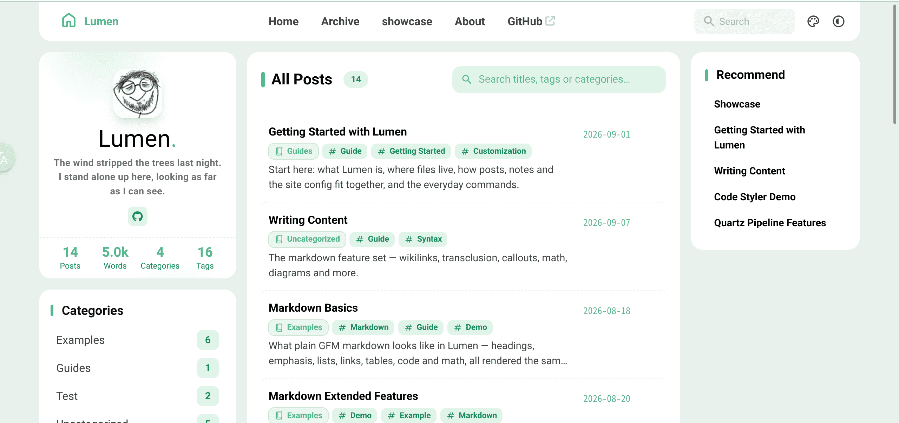
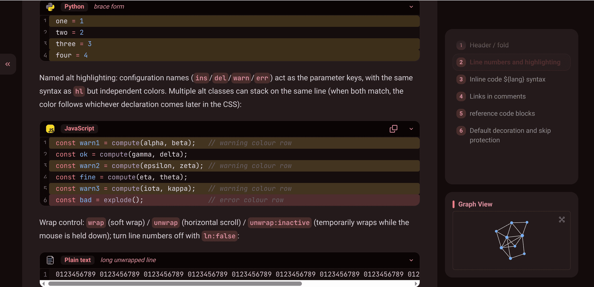
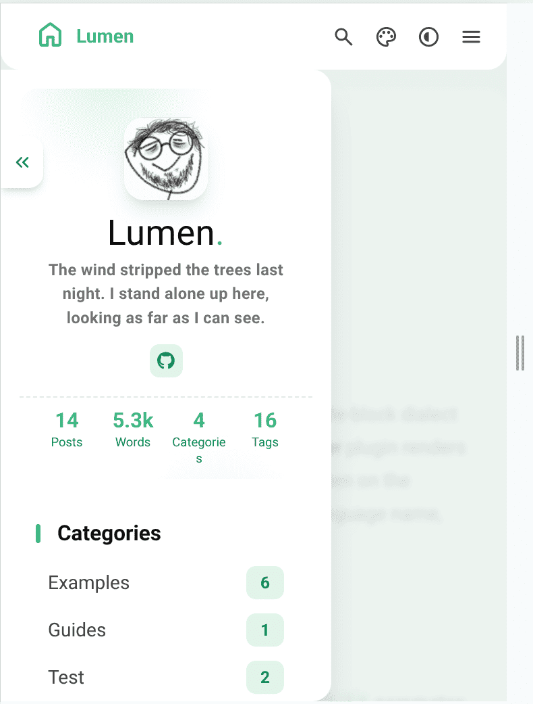
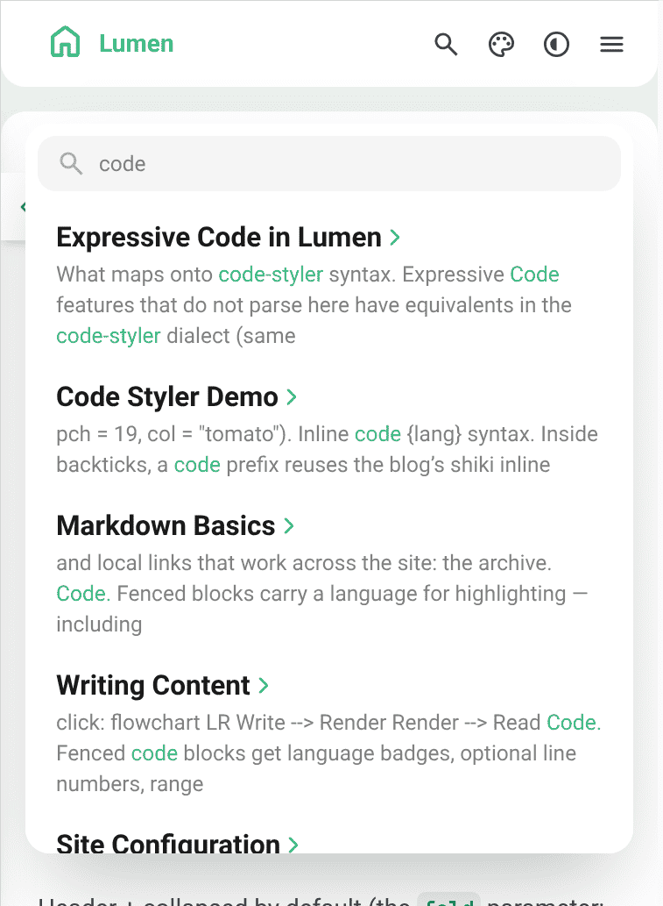
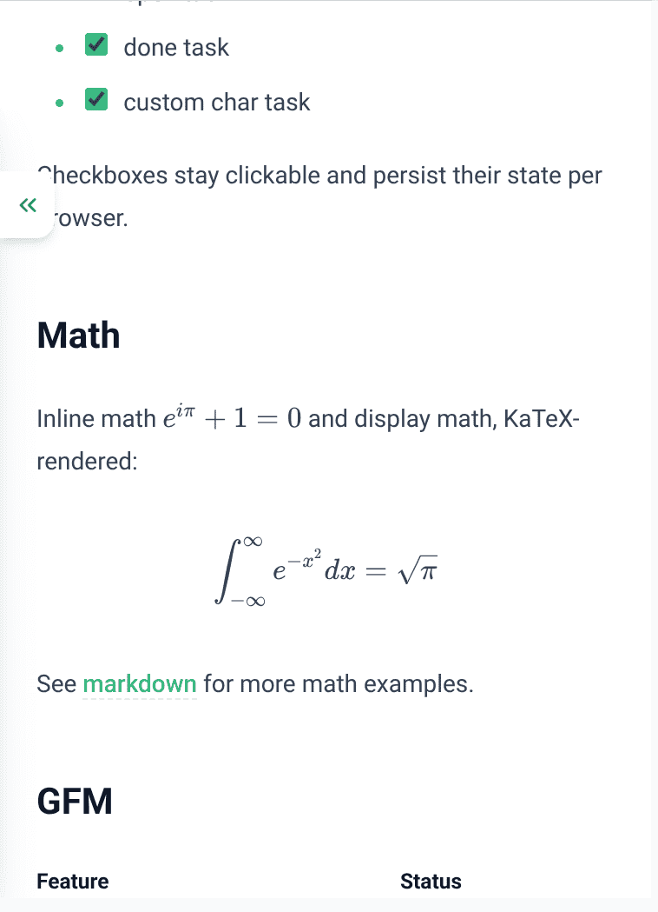
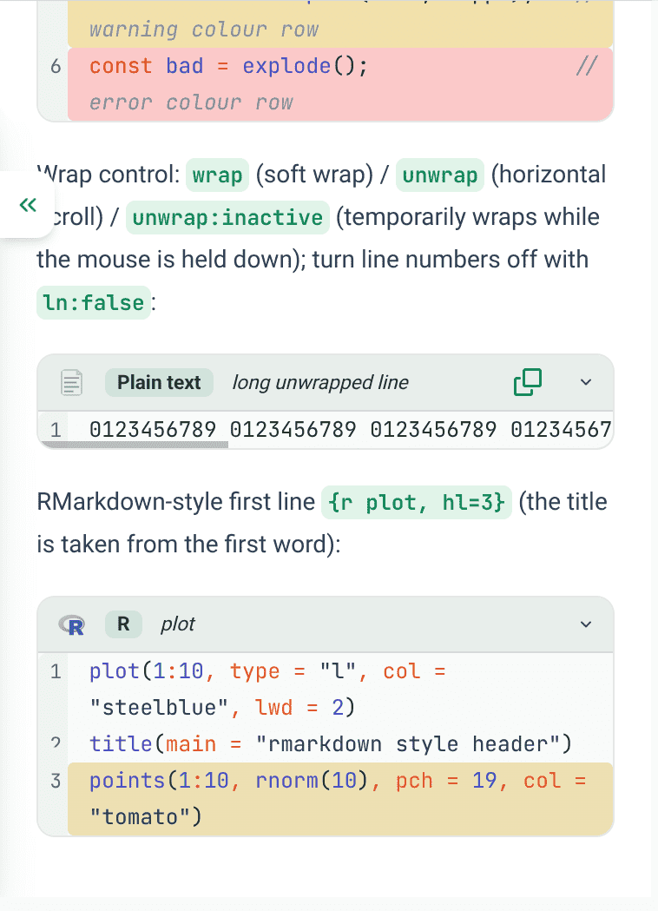
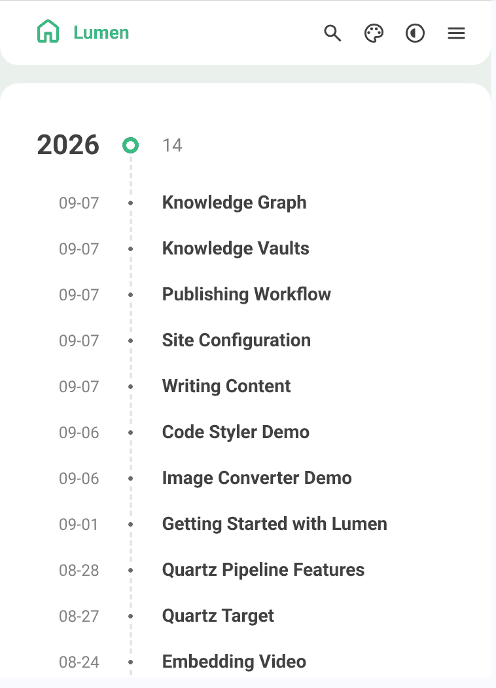
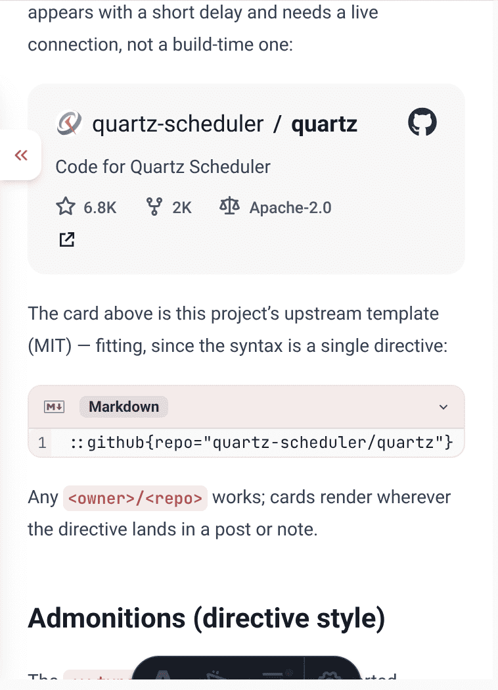

# Lumen
README in [中文](docs/README.zh-CN.md)
> **Blog & Knowledge Base** — a fully static personal site driven by its content model: write in Obsidian-style Markdown and it automatically becomes a blog + wiki + knowledge graph.



**Lumen** is built on [Astro](https://astro.build) and deeply customized from the blog template [Fuwari](https://github.com/saicaca/fuwari): it bundles a Quartz-style Markdown rendering pipeline (wikilinks / Callouts / KaTeX / mermaid / code enhancements) and rebuilds everything around a "**the directory is everything**" content model — there is no dedicated "blog posts" collection, no default knowledge base, and not even standalone page templates. Configuration, pages, articles, and notes are all Markdown under `src/content/`; everything else is derived automatically by the code.

<p align="center">
  
</p>

⚡ Pure static output (hostable anywhere) · 📝 Write Obsidian syntax verbatim · 🔍 Full-text search · 🕸 Knowledge graph · ⚙️ Single-file config, applied on save

---

## 🖼 Interface preview

Single-column overview on mobile, the full-text search panel, and extended-syntax typesetting:

<p align="center">
  
  
  
</p>

Enhanced code blocks (line numbers / highlights / titles, light & dark themes), an archive page grouped by year, and an "the directory is the page" about:

<p align="center">
  
  
  
</p>

> 📷 The screenshots above are **placeholders**. To replace one with a real capture, drop a PNG with the same filename into `docs/screenshots/` and it takes effect automatically (the README references the files by name); placeholders can be regenerated anytime with `node scripts/gen-readme-screenshots.mjs`.

---

## 🗺 Content model: everything is Markdown

| What you want | How | Result |
| --- | --- | --- |
| Site configuration | Edit `src/content/index.md` (YAML + body list) | Title, theme, navigation, license… applied on save |
| A blog post | Add `published:` to the frontmatter of any vault note | Appears in the homepage overview / archive / RSS, with an article header, license card, structured data, and prev/next links added automatically |
| A static page | `src/content/<name>/index.md` | Becomes `/<name>/` directly (that is how `/about/` works) |
| A knowledge vault | `mkdir src/content/<vault-name>` | Collection, routes, navigation, and graph nodes all register themselves |
| A knowledge note | Drop a `.md` into a vault (any depth, Chinese names welcome) | Readable at `/<vault-slug>/<slug>/` immediately |

There is only one rule: **directory = route, and a directory's root `index.md` = page**. Apart from real code routes (`archive`), nothing is reserved; vault directories, articles, and pages receive no special treatment over one another.

## ✨ Features

### 📝 A Quartz-style Markdown rendering pipeline

Every note shares a single unified-based pipeline (`@quartz-community/*` plugins plus an in-repo adapter layer, see `src/integrations/quartz-pipeline/`):

- **Obsidian-flavored syntax**: `[[wikilink]]` (cross-vault, resolved by alias or filename), `![[embed]]` transclusion, Callouts / Admonitions, highlight marks, blockquotes
- **Math & diagrams**: LaTeX (rendered with KaTeX, automatically excluded from the Pagefind index), Mermaid (with fullscreen), GFM, smartypants
- **Heading system**: automatic anchors, sectionized paragraph structure, on-site TOC (the knowledge-note sidebar lists the full hierarchy)
- **Code blocks**: light & dark theme highlighting, a ported code-styler dialect (line numbers, highlighted lines, line ranges, titles, folding…), inline-code styling
- **Images**: path resolution and guard rails for in-repo / embedded images (case-insensitive fallback lookup), a ported image-converter dialect (alignment / size / rounded-corner marks)
- **Misc**: directive components (`:github` repo cards, etc.), raw HTML preserved (paste videos / iframes directly)

### 🗄 Knowledge vaults (Obsidian-style multi-vault)

- Every top-level directory under `src/content/` is a vault: route = the directory name's github-slug; Chinese directory / file names are free
- Wikilinks and embeds resolve **across vaults** (resolved to final URLs at build time; `aliases` / `permalink` are both understood)
- Each vault's root `index.md` is an auto-maintained vault home: its tagged area refreshes as notes are added or removed, and hand-written content is **never overwritten** (`pnpm index-vaults` runs automatically via `predev` / `prebuild`)
- **Knowledge graph**: whole-site link data (`/linkgraph.json`), a local neighborhood graph on every note page, and a global graph on `Ctrl/Cmd+G` (drafts are automatically excluded from the output, consistent with pages)
- Note pages offer a sidebar drawer for navigation (`KbSidebarDrawer`) — friendly for long notes and deep hierarchies

### 🎨 Blog experience

- Light / dark / system three-state theme; the site-wide theme hue is configurable and visitors can also pick their own
- swup-driven page transitions, caching, and preloading; responsive three-column layout
- Pagefind full-text search (KaTeX noise automatically exempt); archive page grouped by year with tag / category filters
- RSS / sitemap / robots.txt; image lightbox (PhotoSwipe)
- UI copy in 10 languages (`en / zh_CN / zh_TW / ja / ko / es / th / vi / tr / id`), switched instantly by `site.lang`
- Post-page capabilities: article header (word count / reading time / date / category / tags), license card, BlogPosting structured data, prev/next links

## 🚀 Quick start

Requirements: **Node.js ≥ 22.12**, **pnpm 9** (the repo enforces pnpm via `only-allow`).

```bash
git clone https://github.com/Luciansi/lumen.git
cd lumen
pnpm install
pnpm dev          # http://localhost:4321
```

Production build (runs the Pagefind index automatically) and a local preview:

```bash
pnpm build
pnpm preview      # output in dist/
```

Before your first deployment, remember to set `site` in `astro.config.mjs` to your real domain (canonical / RSS / sitemap all derive from it).

## ✍️ Writing content

### A blog post = a dated note

There is no separate "blog post" concept. Write a note however you like, then add `published` to its frontmatter:

```yaml
---
title: My First Article
published: 2026-09-07        # a note carrying this becomes an "article"
description: One line for cards and meta tags.
image: images/cover.png      # cover: http(s):// URL, /public path, or note-relative path
tags: [Foo, Bar]
category: Front-end           # optional grouping (shown in the article header)
draft: false                 # true = dev-only; excluded from output / archive / search / graph
original: true               # optional: pin to the top of the homepage list (the "随笔" category is treated as original)
aliases: [alternate-name]    # optional: extra wikilink targets
---
```

The schema is loose — any Obsidian / custom keys are preserved (Quartz's `permalink`, `cssclasses`, `created`, `modified`, etc. are also understood by the pipeline).

### Knowledge vault notes

Create a directory under `src/content/` to create a vault; files inside may be nested freely (a directory's overview page is that directory's `index.md`):

- Vault and file names support Chinese and multi-level paths; routes are github-slugged automatically — avoid colliding with real page routes (`archive`)
- **New vault directories need a dev-server restart to register** (collections and navigation are derived per directory); new files inside an existing vault take effect immediately
- Write directly with [Obsidian](https://obsidian.md) by opening `src/content/`, or use the CLI:

| Command | Purpose |
| --- | --- |
| `pnpm new-note <vault>` | Interactive wizard: pick location / category path → directory overview page or standalone note → blank / standard / tutorial template; checks filename and slug conflicts automatically, leaves no dirty files if interrupted |
| `pnpm index-vaults` | Manually refresh the auto-index area on every vault home |

## ⚙️ Config hub (`src/content/index.md`)

All site configuration lives in this single file (its body also carries the homepage's "overview order" and "featured cards" lists). Save and it applies — no restart needed:

| Group | Controls |
| --- | --- |
| `site` | browser title / tagline / UI language |
| `themeColor` | theme hue `0–360`, whether visitors may choose their own |
| `banner` | homepage banner image, alignment, and credit |
| `toc` / `graph` | TOC toggle and depth / graph toggle and neighborhood breadth, tag pseudo-nodes |
| `favicon` | light & dark icons (blank = built-in) |
| `nav` | navigation links: auto-translated presets (home/archive/about) + custom entries + insertion point for knowledge-vault links |
| `license` / `profile` | post-footer license / homepage profile card (avatar, social buttons) |
| `ui` | optional homepage copy overrides (falls back to the defaults for the language when absent) |

> A few settings still live in code: the rendering-pipeline config (`src/integrations/quartz-pipeline/config.ts`) and `astro.config.mjs` (`site` domain, `base` subpath, integrations) — editing those requires a dev-server restart.

## 📖 Built-in docs (the showcase vault)

`src/content/showcase/` is a **ready-to-run onboarding guide and feature demo** — the notes are the documentation, browsable in-site at `/showcase/` once built. Start from the reading path laid out on the homepage (guide → writing-content → knowledge-vaults → site-configuration). Quick tour of the pieces:

| Doc | Topic |
| --- | --- |
| `guide` | Getting started: content map, common frontmatter, everyday commands, first-day checklist |
| `writing-content` | Full writing-syntax reference: wikilinks / embeds / Callouts / code blocks / image directives |
| `markdown` / `markdown-extended` | Basics and extended Markdown (tables, footnotes, strikethrough, attribute lists…) |
| `expressive-code` / `code-styler` / `image-converter` | Code and image dialects: comparison with the upstream expressions, parameters, and pitfalls |
| `video` | YouTube / Bilibili video embeds |
| `knowledge-vaults` / `knowledge-graph` | The vault model and graph mechanics |
| `site-configuration` | Item-by-item reference for the config file |
| `publishing-workflow` | Build, search indexing, and deployment |
| `quartz-features` / `quartz-target` | Rendering-pipeline regression-test pages and translation anchors (fixtures) |
| `draft` | Live demo of the draft mechanism (visible in dev, absent from output) |

## 📦 Common commands

| Command | Purpose |
| --- | --- |
| `pnpm dev` | Local development (refreshes vault indexes automatically on start) |
| `pnpm build` | Production build + Pagefind index → `dist/` |
| `pnpm preview` | Locally preview the build output |
| `pnpm check` / `pnpm type-check` | Astro content and type validation / TypeScript checks |
| `pnpm new-note <vault>` | Write a note or directory overview page into an existing vault (interactive wizard) |
| `pnpm index-vaults` | Refresh the auto indexes of all vaults |
| `pnpm format` / `pnpm lint` | Biome format / check (`--write`) |
| `node scripts/gen-readme-screenshots.mjs` | Regenerate the README's placeholder screenshots |

## 🗂 Directory structure

```
lumen/
├── astro.config.mjs            # site/base, swup/astro-icon/quartz-pipeline/svelte/sitemap
├── src/
│   ├── content/                # all content & site config (a directory is a vault)
│   │   ├── index.md            #   config hub + homepage overview / featured ordering
│   │   ├── about/              #   static-page example: a directory + root index.md = /about/
│   │   └── showcase/…          #   built-in docs vault (one top-level directory per vault)
│   ├── integrations/quartz-pipeline/  # Quartz pipeline: Astro integration + adapted plugins
│   ├── pages/                  # routes: home / archive / [vault]/…slug / linkgraph / rss / sitemap
│   ├── content.config.ts       # collection registration (one per vault, derived from directories)
│   ├── components/  layouts/   # Astro + Svelte components and layouts
│   └── styles/  i18n/  utils/  constants/  types/
├── scripts/                    # writing wizard, index refresh, sample-asset generation
├── public/                     # static assets (favicon, etc.)
└── docs/                       # screenshots, the Chinese README, upstream template README translations
```

## 🧰 Tech stack

[Astro](https://astro.build) 7 (unified pipeline) · [Tailwind CSS](https://tailwindcss.com) 4 · [Svelte](https://svelte.dev) 5 · TypeScript strict; [Pagefind](https://pagefind.app) (search), [swup](https://swup.js.org) (transitions), KaTeX, Mermaid, PhotoSwipe, d3 + PixiJS (graph, loaded on demand); the `@quartz-community/*` Markdown ecosystem; [Biome](https://biomejs.dev) (formatting & linting); pnpm.

## ☁️ Deployment

`dist/` is purely static output (Pagefind index included) with no server-side runtime:

- **Vercel**: leave `vercel.json` empty; build command `pnpm build`, output directory `dist`
- Netlify / Cloudflare Pages / GitHub Pages / any static host work the same
- For sub-path hosting, just set `base` in `astro.config.mjs`; in-site links get the prefix automatically

## ❓ FAQ

- **Why is there no `posts` collection or `new-post` command?** Because none is needed: a note with a `published` date *is* the article, and article capabilities (license card, JSON-LD, prev/next) are built into note pages. The single model replaces the whole suite of "post vs note" branching in the homepage / archive / RSS.
- **A new vault 404s?** Collections are registered from directories when the dev server starts: create the directory, then restart the dev server once; new files inside an existing vault need no restart.
- **Want to see it in action before customizing?** The `showcase` vault is the demo: `pnpm dev`, then visit `/showcase/`; delete it or reshape it to start your own site.

## 📄 Credits & license

- Built on [Fuwari](https://github.com/saicaca/fuwari) (MIT License © 2024 saicaca)
- The Markdown pipeline reuses the `@quartz-community/*` packages from the [Quartz](https://quartz.jzhao.xyz) community ecosystem; the code / image dialects are ported from the Obsidian plugins Code Styler and Image Converter
- This repository is licensed under the MIT License (see [LICENSE](LICENSE); upstream copyright notices are retained). `docs/` also contains multilingual translations of the upstream template's README (the original template prevails)
