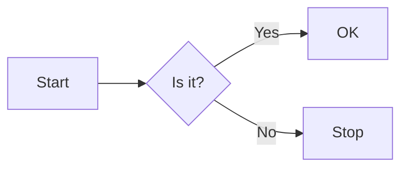

This post demonstrates how the code-block dialect ported from the Obsidian **Code Styler** plugin renders on this blog. All parameters are written on the opening fence line, right after the language name, where `:` and `=` are equivalent.

## Header / fold

Header + collapsed by default (the `fold` parameter; the default collapse label comes from the `fold:` placeholder):

```cpp fold title:"binary_search.cpp" hl:1,5-6
int binary_search(int* a, int n, int key) {
    int lo = 0, hi = n - 1;
    while (lo <= hi) {
        int mid = lo + (hi - lo) / 2;
        if (a[mid] < key) lo = mid + 1;
        else if (a[mid] > key) hi = mid - 1;
        else return mid;
    }
    return -1;
}
```

No title, with a custom collapse label (`fold:"Collapsed section"`); click the header to expand/collapse:

```python fold:"Collapsed section"
def parse(stream):
    """Demo of a plain fold with a custom placeholder."""
    for line in stream:
        if line.startswith("#"):
            yield line[1:].strip()
```

Titles as links (`ref:[[quartz-features|Features]]` and an external `title:[astro](https://astro.build)`):

```ts ref:[[quartz-features|Quartz Features]]
export const kind = "note";
export const nested = { count: 2 };
```

```python title:[astro](https://astro.build)
print("external link in the header title")
```

The language tag and icon are **always shown** by default (config `header.showLanguageTag/showLanguageIcon: "always"`); every decorated block has a header, and clicking it toggles fold/unfold (same as the plugin). Switching to `"ifHeader"` shows them only when a title/fold is present.

## Line numbers and highlighting

`ln:N` offsets the line numbers (numbering starts at N):

```python title:"reader.py" ln:20
def read_file(path):
    with open(path) as fh:
        return fh.read()
```

`hl:` highlighting supports combinations of line numbers / ranges / words / regular expressions (comma-separated, no spaces). Note that, like `ln:`, `hl` line numbers are counted **against the displayed line numbers**: there is no offset below, so `hl:1,3-4` means lines 1 and 3-4, plus the lines matched by the word `def` and the regex `/read/`:

```python title:"highlights" hl:1,3-4,def,/read/
def read_file(path):
    with open(path) as fh:
        return fh.read()

def main():
    data = read_file("input.txt")
    for line in data.splitlines():
        print(line)
```

Combined with `ln:20`, highlighting the four lines starting at source line 1 means writing `hl:20,23-25` (the corresponding displayed line numbers). The RPC/Expressive-Code-compatible form `{1,3-4}` is equivalent:

```python title:"brace form" {1,3-4}
one = 1
two = 2
three = 3
four = 4
```

Named alt highlighting: configuration names (`ins`/`del`/`warn`/`err`) act as the parameter keys, with the same syntax as `hl` but independent colors. Multiple alt classes can stack on the same line (when both match, the color follows whichever declaration comes later in the CSS):

```js warn:1,3,5 err:6
const warn1 = compute(alpha, beta);   // warning colour row
const ok = compute(gamma, delta);
const warn2 = compute(epsilon, zeta); // warning colour row
const fine = compute(eta, theta);
const warn3 = compute(iota, kappa);   // warning colour row
const bad = explode();                // error colour row
```

Wrap control: `wrap` (soft wrap) / `unwrap` (horizontal scroll) / `unwrap:inactive` (temporarily wraps while the mouse is held down); turn line numbers off with `ln:false`:

```text unwrap title:"long unwrapped line"
0123456789 0123456789 0123456789 0123456789 0123456789 0123456789 0123456789 0123456789 0123456789 0123456789 0123456789 0123456789
```

RMarkdown-style first line `{r plot, hl=3}` (the title is taken from the first word):

```{r plot, hl=3}
plot(1:10, type = "l", col = "steelblue", lwd = 2)
title(main = "rmarkdown style header")
points(1:10, rnorm(10), pch = 19, col = "tomato")
```

## Inline code {lang} syntax

Inside backticks, a `{python} code` prefix reuses the blog's shiki inline highlighting; the `{}{…}` empty-group escape lets you write literal braces:

`{python} for i in range(3): print(i)` — inline highlight with a language tag.

`{python title:'Inline If'} 'yes' if flag else 'no'` — parameters after the language are parsed, but v1 does not render the icon/title prefix yet.

`{}{python} this text shows literal {python} braces` — the escape form.

`{cpp} int main() {}` — languages that cannot be suffixed degrade to plain text (consistent with the plugin).

## Links in comments

`[[wikilink|alias]]` and `[text](url)` in code comments render as clickable links:

```python title:"comment links"
# Look here: [[quartz-features|quartz features]] and the external [astro](https://astro.build)
def helper():
    """links in docstrings are not processed; only comment tokens are"""
    return 42
```

```js title:"js comment link"
// [[guide]] — without an alias, the file name is used (extension stripped)
const x = 1; // [another site](https://example.com)
```

## reference code blocks

Inside a ` ```reference ` block, YAML parameters point to the file (read from the repo at build time), supporting `@/` for the repo root, relative paths, `[[wikilink]]`, and `start`/`end` (a number / a word / a regex / `+N`):

```reference
file: @/package.json
lang: json
start: 2
end: 10
```

Relative path + regex slicing:

```reference
file: ../../../scripts/extract-code-styler-icons.mjs
language: js
start: /function findObject/
end: +3
```

```reference
file: [[quartz-features|Features]]
```

Erroneous cases (path escape and remote URLs) render as notice blocks:

```reference
file: ../../../../../../etc/passwd
```

```reference
file: https://github.com/mayurankv/Obsidian-Code-Styler/blob/main/README.md
```

## Default decoration and skip protection

Fences without any parameters still get the Code-Styler default look (line structure + default line numbers/wrapping, no header) — consistent with the Obsidian default theme. The following are still not decorated: mermaid diagrams and blocks with the `ignore` parameter:



```python ignore title:"ignored block"
print("this block stays completely native")
```

```python
print("plain fence — decorated with the default theme")
```
