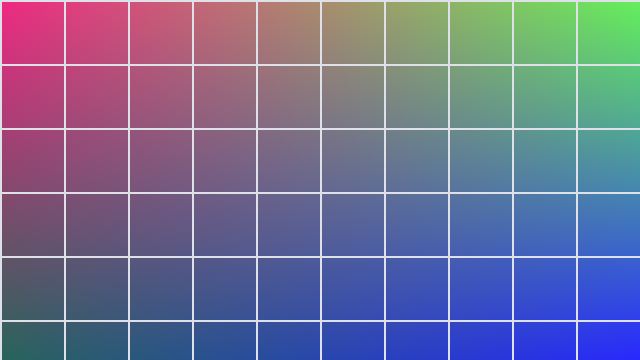

This article demonstrates the image alignment tokens of the Obsidian **Image Converter** plugin, as ported to this blog. The syntax: after the image target, append tokens separated by `|` — a trailing number (`400` or `400x300`) is a size that Obsidian itself understands natively, while **`left` / `center` / `right` / `wrap` are parsed at build time by this port**: position and wrapping become CSS classes (`image-position-*` / `image-wrap`), sizes become `width`/`height` attributes, and the tokens never leak into the final alt text. Writing these from the plugin's "Align image" context menu in Obsidian produces exactly this syntax, so notes sync over unchanged.

All three writing forms work, both wiki embeds and markdown links:

```text
![[images/demo-landscape.png|right|wrap|423x80]]

[images/demo-landscape.png|right|wrap|240](images/demo-landscape.png)
```

## Wiki embed: left-aligned + wrapped (left|wrap)

`![[images/demo-landscape.png|left|wrap|320]]` — only a width `320` is given; Astro fills in the height from the image's intrinsic ratio:

![[images/demo-landscape.png|left|wrap|320]]

This demo image is a script-generated placeholder: four corner tints over a 64px white grid, designed for eyeballing scale and wrap gutters — narrow the browser window and you can watch the image shrink with the container while text stays glued to its right and bottom edges. The wrap spacing matches the plugin (1em on the right, 0.5em below). The paragraphs below — every one of them — keep flowing around the image's right edge until the floated image "ends". That is the core difference between `wrap` and non-wrapped: without wrapping, text always resumes below the image and never sneaks in beside it. Text wrapping is the workhorse of image-heavy notes: one schematic next to a bullet list, floating on the paragraph's left (or right), with the follow-up sentences flowing naturally around it instead of splitting the page into two stacked chunks. Multiple images can be used together too — each stacks according to its own `clear` direction.

## Wiki embed: right-aligned + wrapped + full size (right|wrap|WxH)

`![[images/demo-portrait.png|right|wrap|160x256]]` — `160x256` is written into **both** width and height (same semantics as `|WxH` in Obsidian: no ratio preservation, stretched as-is):

![[images/demo-portrait.png|right|wrap|160x256]]

The portrait floats right and text wraps to its left. Note that token order does not matter (the plugin parses them in any order), but the Obsidian context menu always writes back the canonical order `position → wrap → size`; this blog accepts both. The size token is only recognized as the single trailing section: it must be the last `|`-separated section and purely numeric (optionally with an `x`), so in `|right|wrap|423x80` it parses as width 423, height 80. If a number sits in the middle (`|wrap|423x80|right`) it is not a size but part of the caption text — same as the plugin.

## Centered (center)

`![[images/demo-landscape.png|center|220]]` — block-level centering at a fixed width of 220:

![[images/demo-landscape.png|center|220]]

When centering, the `wrap` token has no effect (the plugin always renders `center` as a block with auto margins; floating is meaningless), so the following renders identically to the image above:

![[images/demo-landscape.png|center|wrap|220]]

## Left/right without wrapping (edge blocks)

A position token without `wrap` means "flush to the side, but no text wrapping": the image renders as a block against its padding edge and text continues below it. `right` without wrap flushes right:

![[images/demo-landscape.png|right|280]]

Notice the blank space to the image's left above: it is a block flush against the right margin, not a float, so later text never fills that side — compare with the first example, where that paragraph wrapped around the image, while this one starts on a fresh line. Likewise, `left` without wrap flushes left:

![[images/demo-landscape.png|left|280]]

## Markdown link form: caption preserved as alt

`` — in a markdown link's bracket area, the **first `|` section is always the caption/alt slot** and is never treated as a token (even if it happens to read `right`):


A caption can itself contain further `|` sections (e.g. `Part A|Part B`), as long as they are not part of a consecutive token run at the tail; they are all preserved. At render time the tokens are stripped and the caption becomes the final alt text — hovering the image (or a failed load) shows "Alt caption" instead of a `|left|wrap` noise string. This matches Obsidian's caption handling: the plugin places the caption after the path/alt and before the tokens, in the order `target/alt → caption → position → wrap → size`.

## Markdown link form: size only

`` — no position/wrap tokens, only a trailing size, so only the width is applied (same Astro image pipeline as the wiki form `![[…|300]]`):


## Bang-less links rendered as images

`[images/demo-landscape.png|right|wrap|240](images/demo-landscape.png)` — when the link target is a raster image (webp/png/jpg/jpeg/gif/bmp/jxl) and the link text carries tokens or a size, the whole link renders as an embedded image (config option `imageConverter.convertImageLinks`, enabled by default):

[images/demo-landscape.png|right|wrap|240](images/demo-landscape.png)

These "no-bang image links" are what the plugin and tools like ImageResizer generate inside Obsidian (their size parameter lands at the end of the link text); plain text links to non-images are unaffected and remain ordinary links. The paragraph you are reading is the one wrapped around the image above.

## Syntax edge cases

- **A lone `wrap` (no position token) produces no alignment**, but the token is still stripped from the alt. `![[images/demo-portrait.png|wrap|220]]` renders as a plain image (no alignment class):

![[images/demo-portrait.png|wrap|220]]

- **Tokens must form a consecutive tail**: parsing stops at the first non-token word (`left/center/right/wrap` or anything besides the trailing size) counting back from the end; anything before that belongs to the caption. `` therefore produces no alignment — the middle word cuts the token tail off.
- **Repeated position words in one tail** is malformed (the plugin's context menu always writes exactly one position token); this port follows the plugin's parser character-for-character and adds no conventions of its own.
- **Whole-note opt-out**: setting `image-converter-ignore: true` in frontmatter skips this port for that note entirely (syntax mirroring `code-styler-ignore`).
- **Known limitation**: escaped `\|` inside GFM table cells cannot be reliably reconstructed after remark parsing (not fully equivalent to the plugin's own table `\|` handling); tokens apply only to the raster extensions above — `.svg`, video and PDF embeds are excluded, matching the Obsidian plugin.

## Notes

The two placeholder demo images are deterministically generated by `node scripts/gen-image-converter-assets.mjs` and committed under `src/content/showcase/images/` (the demo content vault); delete those two files when replacing them with real images. This port is **purely build-time**: edit the tokens in a note and rebuild — no client-side JavaScript runs on the page, and PhotoSwipe's click-to-zoom keeps working on aligned images as usual.
