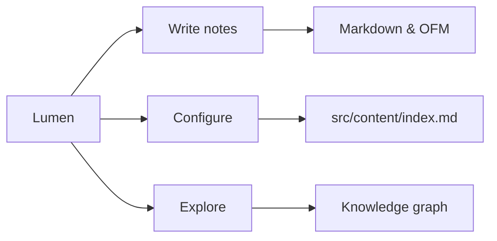

Welcome to the **Showcase** vault — a guided, English-language tour of Lumen itself. Every note here is real content living in `src/content/showcase/`, so what you read is also what the pipeline actually renders: wikilinks, callouts, math, graphs, and all.

<!-- auto-index:start -->
- [[code-styler|code-styler]]
- [[draft|draft]]
- [[expressive-code|expressive-code]]
- [[guide|guide]]
- [[image-converter|image-converter]]
- [[knowledge-graph|knowledge-graph]]
- [[knowledge-vaults|knowledge-vaults]]
- [[markdown-extended|markdown-extended]]
- [[markdown|markdown]]
- [[publishing-workflow|publishing-workflow]]
- [[quartz-features|quartz-features]]
- [[quartz-target|quartz-target]]
- [[site-configuration|site-configuration]]
- [[video|video]]
- [[writing-content|writing-content]]
<!-- auto-index:end -->

## Suggested reading

Not sure where to start? The notes above fall into natural routes:

- **New to Lumen** — [[guide]] explains the content map and the everyday commands, [[writing-content]] covers the syntax that works everywhere, [[knowledge-vaults]] how folders become vaults.
- **Tuning the site** — [[site-configuration]] walks the single config file, [[publishing-workflow]] covers builds and deploys.
- **Under the hood** — [[quartz-features]] is a one-page regression index of the markdown pipeline, [[knowledge-graph]] explains the link data, [[expressive-code]] and [[code-styler]] map code-block dialects, [[image-converter]] the image pipeline.

## What this vault demonstrates

Every page in this folder is generated the same way as your own notes — no special configuration, no extra code. Add a note below and re-run `pnpm index-vaults` (or restart the dev server) to refresh the index above; the graph in the right rail updates with every wikilink you add.
