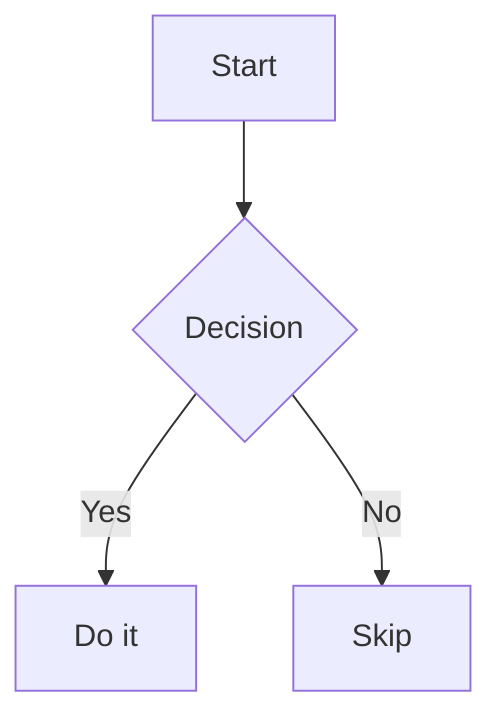

> [!INFO] A regression fixture — and a one-page index
> Every page is rendered by the quartz markdown pipeline; this note exercises its features back-to-back so a change in the pipeline shows up as a broken demo. The section anchors are load-bearing — [[quartz-target]] transcludes back into `#Nested-Anchor` below to verify recursion, so keep the headings and block markers stable. Each feature links to its full documentation note.

## Wikilinks

Resolved across the whole site by file name — [[quartz-target]] plain, [[quartz-target|Target Note]] with an alias, and a deliberately broken link [[nonexistent-note]] (flagged at build time). Syntax details: [[writing-content]].

## Transclusion

Embed whole notes or slices of them — the four forms below mirror the [[quartz-target]] fixture:

Full page: ![[quartz-target]]

Heading: ![[quartz-target#Section-Two]]

Block (paragraph): ![[quartz-target#^par-block]]

Block (list item): ![[quartz-target#^list-block]]

Block (quote): ![[quartz-target#^quote-block]]

## Callouts

The Obsidian `> [!type]` family — plain, fold-open (`+`), fold-closed (`-`), and custom titles:

> [!NOTE]
> A simple note callout.

> [!WARNING]+ Folded by default
> This callout has a fold marker (`+`) and can be collapsed.

> [!TIP]- Collapsed by default
> This one starts collapsed (`-`).

> [!EXAMPLE] With metadata
> Example callout with metadata.

The `:::type` spelling is interchangeable — see [[markdown-extended]] for the directive form.

## Highlights and inline tags

==Highlighted text==, and an inline #quartz-tag that counts as a tag.

## Mermaid



Double-click a rendered diagram to open it fullscreen.

## Task lists

- [ ] open task
- [x] done task
- [/] custom char task

Checkboxes stay clickable and persist their state per browser.

## Math

Inline math $e^{i\pi} + 1 = 0$ and display math, KaTeX-rendered:

$$
\int_{-\infty}^{\infty} e^{-x^2} dx = \sqrt{\pi}
$$

See [[markdown]] for more math examples.

## GFM

| Feature | Status |
| ------- | ------ |
| Tables  | Working |
| ~~Strikethrough~~ | Working |

The GFM base — tables, strikethrough, autolinks, task lists — is covered in [[markdown]].

## Directives

The directive layer (`:::`) feeds admonitions, GitHub cards and more:

:::note
A custom directive admonition works like any other callout.
:::

See [[markdown-extended]] for the full gadget list.

## Code blocks

```ts
const answer: number = 42;
console.log("dual theme", answer);
```

Blocks speak the [[code-styler]] dialect — titles, folds, line numbers and ranges included.

## Nested Anchor

This section is the nested-transclusion anchor (transcluded by quartz-target, back into this page).
