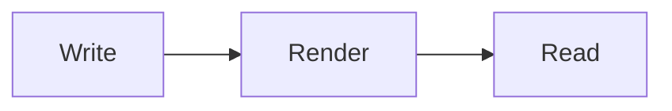

All content — every [[knowledge-vaults|vault note]], dated or not — runs through the same quartz markdown pipeline, so the syntax below works identically everywhere.

## Links, wikilinks and transclusion

Plain URLs autolink, but the native way to move around is the Obsidian-style wikilink. A wikilink resolves by file name across the **whole** site, so notes in different vaults can point at each other:

- `[[knowledge-vaults]]` → a note in this vault
- `[[code-styler|Code Styler]]` → a note in another vault, linked with a custom label
- `[[writing-content#Transclusion|jump to a section]]` → a heading inside another note
- `![[quartz-target]]` → transclude (embed) an entire page
- `![[quartz-target#Section-Two]]` → embed one heading's content
- `![[demo-portrait.png|300|right]]` → embed an image with size and alignment

Broken targets are caught at build time, so a renamed note surfaces as a warning instead of a silent dead link.

## Callouts, highlights and tasks

> [!TIP]+ Notes from the road
> Callouts come in the Obsidian flavors — `note`, `warning`, `tip`, `example`, `important` and friends. A `+` shows them expanded by default, `-` collapses them.

Inline decoration follows OFM too: ==this text is highlighted==, and `%%this is a comment%%` never renders. Checklists work as plain markdown tasks:

- [ ] a task to do
- [x] a task that is done

## Math and diagrams

Inline math `$E = mc^2$` and display math are rendered with KaTeX:

$$
x = \frac{-b \pm \sqrt{b^2 - 4ac}}{2a}
$$

Mermaid diagrams render from a fenced block and open fullscreen on double click:



## Code

Fenced code blocks get language badges, optional line numbers, range and named highlights, and a copy button — all from the Code Styler pipeline:

```ts title="hello.ts" ln
function greet(name: string): string {
  return `Hello, ${name}!`;
}
```

## Frontmatter

Vault notes keep an open schema — any Obsidian key is preserved. Keys the engine reads: `title`, `published` (a dated note becomes an article: homepage overview, archive, RSS), `description`, `tags`, `draft: true` (dev-only preview, stripped from production builds), plus `aliases` and `permalink` for link resolution.

See also how the surrounding site is tuned in [[site-configuration]].
